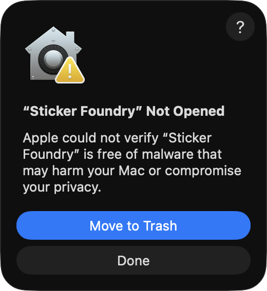
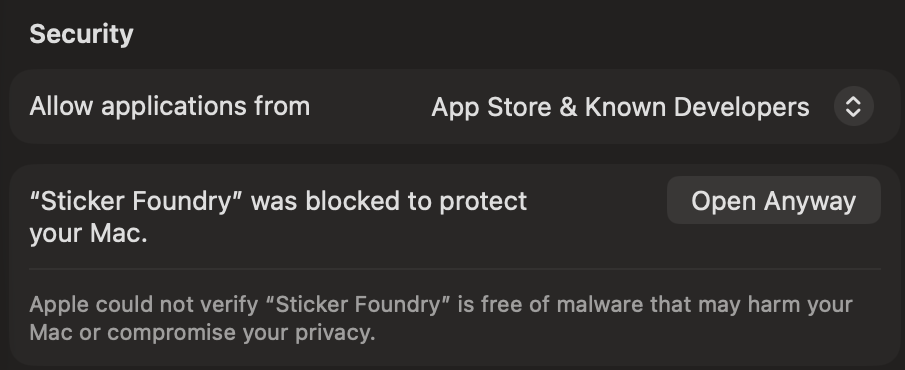
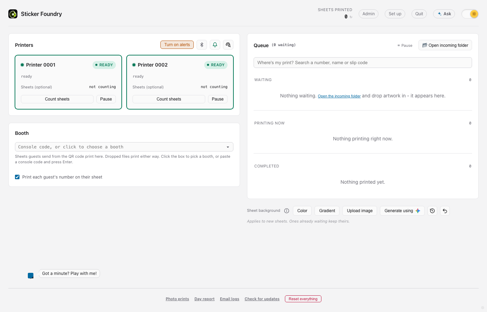
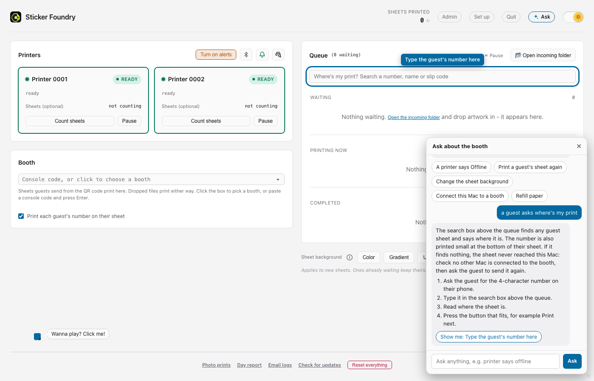

# Sticker Foundry: the short guide

Sticker Foundry turns a Mac and Bluetooth print-and-cut sticker printers into a sticker
booth. Each print is one 4 x 7 inch sheet, printed and cut round every sticker.

Sheets come from a folder on the Mac, or from guests' phones (they scan a QR code and send
their stickers). This page keeps only the important things. For anything else, press
**Ask** at the top right of the console.

## Quick start: ready in 10 minutes

You need a Mac, one or more printers and sticker paper.

**1. Install it.** Download Sticker Foundry from the [download page](README.md#download-for-mac)
(Apple Silicon or Intel, whichever your Mac is) and drag it into **Applications**. The first
time, macOS stops it. Press **Done** (not Move to Trash):



*Press Done, not Move to Trash.*

Then open **System Settings**, **Privacy & Security**, scroll down and press **Open Anyway**.
When it asks to use **Bluetooth**, press **Allow**.



*Scroll down to Security and press Open Anyway.*

Or install with one line, in **Terminal**, with no Open Anyway step:

```
curl -fsSL https://github.com/BansalAakash/sticker-foundry-releases/releases/latest/download/install.sh | bash
```

**2. Follow the setup guide.** It opens by itself. Switch the printers on, put them near the
Mac and press **Search for printers**. Then load paper and ribbon, and pick your booth if
guests print from their phones.


*Two printers found and connected.*

**3. First print.** Press **Open incoming folder** and drop in a PNG image. It joins the queue and
prints. It uses one real sheet, so do this once.

## The console in 8 bullets



*The console. Header: Admin, Set up, Quit, Ask and the light/dark switch.*

- **Printers:** one card each. **Ready** is good.
- **Queue:** waiting, printing now and completed sheets.
- **Booth:** which booth this Mac prints for. The dot is green when it is connected.
- **Pause** and **Open incoming folder:** stop sending sheets, or drop images in to print.
- **Where's my print?** finds one guest's sheet.
- **Sheet background:** the colour or picture behind the stickers.
- **Ask:** the helper, top right.
- **Footer:** pinned to the bottom with a just-for-fun game above it. Click the sticker to play.

## Ask the helper

Press **Ask**, type a question in your own words, and it tells you what to press and rings
the button on screen. Try "A printer says Offline", "Print a guest's sheet again" or
"Change the sheet background".



*Ask answers with steps and rings the button.*

## Important rules

- Do not switch off a printer while it is printing.
- Never clear a fault you have not looked at.
- Keep the Mac plugged in and awake.
- Reprint or print again uses another sheet and another ribbon panel. It never happens by itself.
- Paper and ribbon run out together, so change them together.
- Guests' phones need the booth to have internet. Folder printing works offline.
- Run one Mac per booth.

## When something is wrong

- **Printer says Offline:** switch it off and on, move it closer, then wait a few seconds, or ask the helper.
- **Bluetooth is off:** turn it on in the Mac's menu bar or press the Bluetooth icon in the console, or ask the helper.
- **A card is red:** read the words on it and look at the printer before pressing anything, or ask the helper.
- **Nothing prints:** check **Pause** is not on and a printer says **Ready**, or ask the helper.
- **A guest cannot find their sheet:** type their number in **Where's my print?**, or ask the helper.

Using another AI assistant? Give it [GUIDE-FOR-AI.md](GUIDE-FOR-AI.md) and ask it anything
about the booth. For a real problem, press **Email logs** at the bottom of the console.
