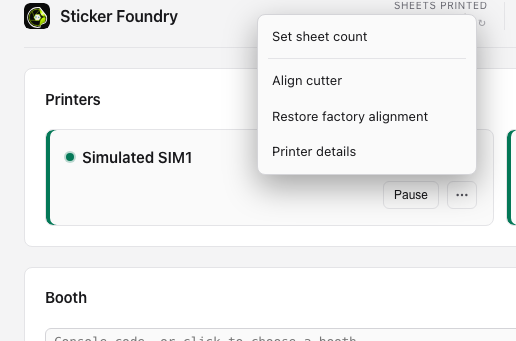
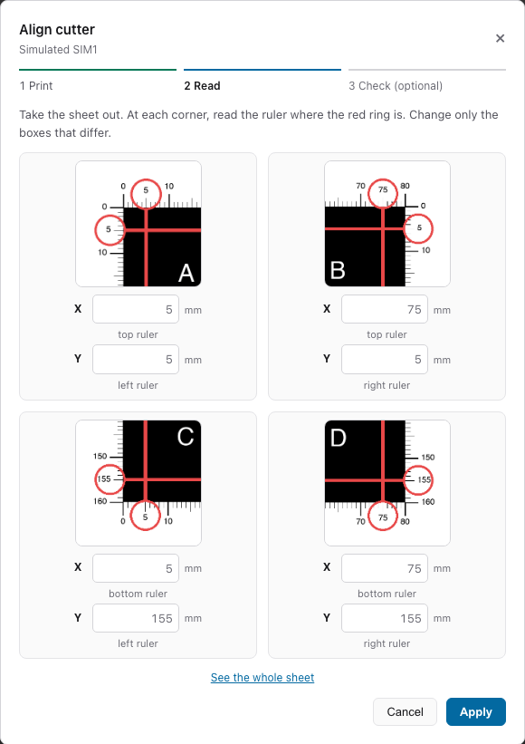
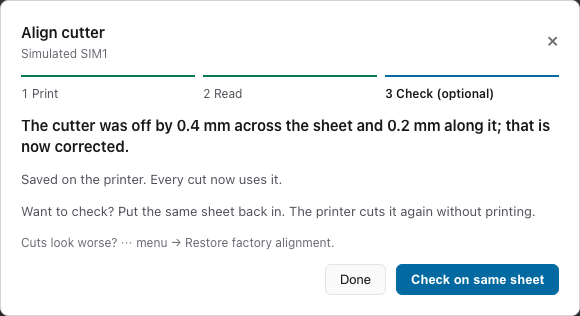
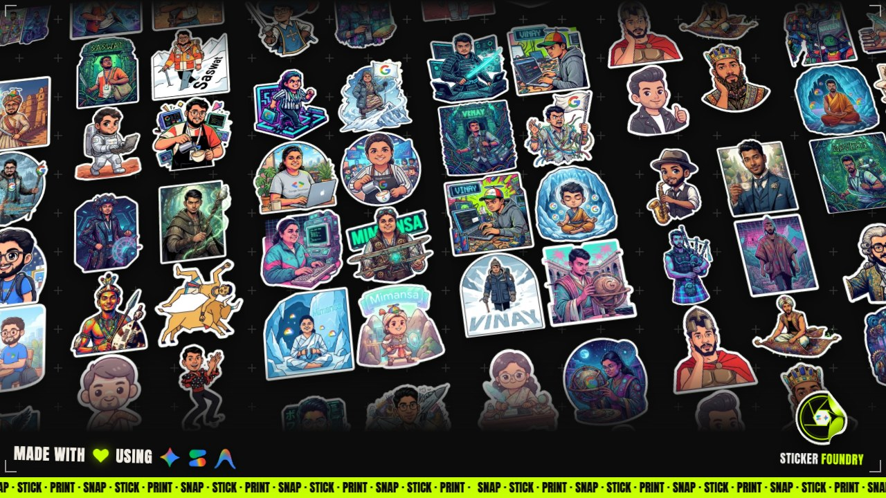

# Sticker Foundry: the short guide

Sticker Foundry turns a Mac and Bluetooth print-and-cut sticker printers into a sticker
booth. Each print is one 4 x 7 inch sheet, printed and cut round every sticker.

Sheets come from a folder on the Mac, or from guests' phones (they scan a QR code and send
their stickers). This page keeps only the important things. For anything else, press
**Ask** at the top right of the console.

## Quick start: ready in 10 minutes

You need a Mac, one or more printers and sticker paper.

**1. Install it.** Download Sticker Foundry from the [download page](README.md#download-for-mac)
(Apple Silicon or Intel, whichever your Mac is) and drag it into **Applications**. The first
time, macOS stops it. Press **Done** (not Move to Trash):


*Press Done, not Move to Trash.*

Then open **System Settings**, **Privacy & Security**, scroll down and press **Open Anyway**.
When it asks to use **Bluetooth**, press **Allow**.


*Scroll down to Security and press Open Anyway.*

Or install with one line, in **Terminal**, with no Open Anyway step:

```
curl -fsSL https://github.com/BansalAakash/sticker-foundry-releases/releases/latest/download/install.sh | bash
```

**2. Follow the setup guide.** It opens by itself. Switch the printers on, put them near the
Mac. Switch a printer on near the Mac and the console finds and connects it by itself. If one
does not appear, press **Search for printers**. Then load paper and ribbon, and pick your booth if
guests print from their phones.


*Two printers found and connected.*

**3. First print.** Press **Open incoming folder** and drop in a PNG image. It joins the queue and
prints.

## The console in 9 bullets


*The console. Header: the sheet count, then Admin, Set up and Wall (with a folder and a copy icon beside it), then Ask, the light/dark switch and Quit.*

- **Printers:** one card each. **Ready** is good. A coloured stripe on the left edge shows how it is doing, and a **Fault** badge appears if it stops. Small battery, ink and USB marks show only when the printer reports them. Plug a printer in with a USB cable and the console uses the cable; it falls back to Bluetooth if the cable link does not work. Experimental. The **...** button on a card opens its menu.
- **Queue:** waiting, printing now and completed sheets.
- **Booth:** which booth this Mac prints for. The dot is green when it is connected.
- **Pause** and **Open incoming folder:** stop sending sheets, or drop images in to print.
- **Where's my print?** finds one guest's sheet.
- **Sheets:** under the queue. **Background** is the colour or picture behind the stickers. Sharp corners of every sticker get a short extra cut, so pointy stickers peel cleanly.
- **Ask:** the helper, top right.
- **Wall:** the sticker wall for a screen at the booth (see below). The folder icon beside it opens your own starter sheets, and the copy icon copies the wall's link.
- **Footer:** pinned to the bottom with a just-for-fun game above it. Click the sticker to play.

## Cuts land beside the print: align the cutter

If the blade cuts beside the stickers instead of round them, align the cutter.



*On the printer's card, press the ... button, then Align cutter.*

1. **Print.** Press **Print test sheet**. The printer prints one test sheet with rulers along its edges. It also cuts four long lines that meet at the corners A, B, C and D.
2. **Read.** Take the sheet out. At each corner, read the ruler where the red ring is. Type the number in the box. Change only the boxes that differ. Press **Apply**. The printer saves the fix.



*Step 2: the red ring is where you read.*

3. **Check (optional).** Press **Check on same sheet**. Put the same sheet back in the tray, alone, printed side up. The printer only cuts it again, and does not print. The new corners should sit on 5, 75, 5 and 155.



*After Apply: the fix is saved on the printer.*

Cuts look worse? Press **...** on the card, then **Restore factory alignment**.

## The sticker wall

The wall is a page for a screen at the booth. It shows your sheets in six tilted columns that
scroll for ever. Now and then a giant word appears behind them, and a "Made with" line with the
Gemini, AI Studio and Antigravity logos comes in. The Sticker Foundry logo sits bottom right.



*The wall, with a giant word behind the sheets.*

- Press **Wall** at the top of the console. It opens in the Mac's browser.
- Drag that window to the booth screen and press **F** for full screen.
- For a screen on another device, press the copy icon beside **Wall** and open that link there, on the same Wi-Fi.
- It shows this booth's own sheets first, then your own starter sheets, then ours, up to 30 sheets.
  Real sheets replace the starter ones as they arrive.
- To add your own starter sheets, press the folder icon beside **Wall** and drop PNG or WebP files with a
  transparent background into the folder. A flat picture, such as a JPEG, is skipped, and the
  button tells you which files.
- A sheet with no transparent background still prints. It just does not show on the wall.

## Ask the helper

Press **Ask**, type a question in your own words, and it tells you what to press and rings
the button on screen. Try "A printer says Offline", "Print a guest's sheet again" or
"Change the sheet background".


*Ask answers with steps and rings the button.*

## Important rules

- Do not switch off a printer while it is printing.
- Never clear a fault you have not looked at.
- Keep the Mac plugged in and awake.
- Reprint and print again never happen by themselves.
- Paper and ribbon run out together, so change them together.
- Guests' phones need the booth to have internet. Folder printing works offline.
- Run one Mac per booth.

## When something is wrong

- **Printer says Offline:** switch it off and on, move it closer, then wait a few seconds, or ask the helper.
- **Bluetooth is off:** turn it on in the Mac's menu bar or press the Bluetooth icon in the console, or ask the helper.
- **A card is red:** it now names the problem, such as a paper jam, a stuck blade or an ink cartridge problem. Read it and look at the printer before pressing anything, or ask the helper.
- **Nothing prints:** check **Pause** is not on and a printer says **Ready**, or ask the helper.
- **A guest cannot find their sheet:** type their number in **Where's my print?**, or ask the helper.

Using another AI assistant? Give it [GUIDE-FOR-AI.md](GUIDE-FOR-AI.md) and ask it anything
about the booth. For a real problem, press **Email logs** at the bottom of the console.
