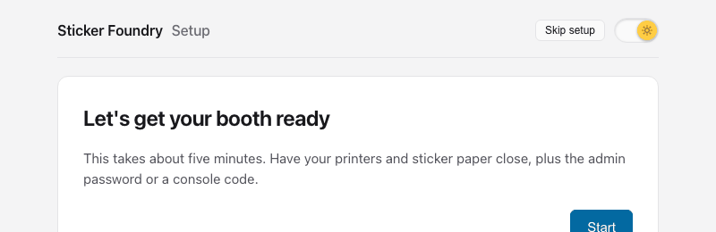
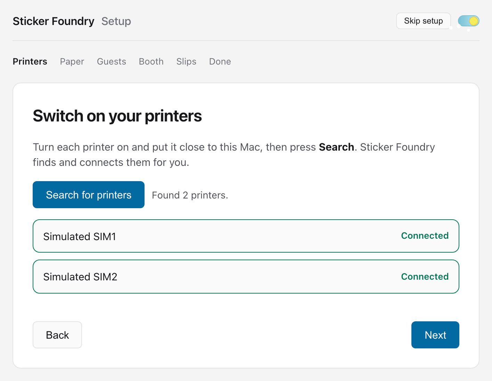
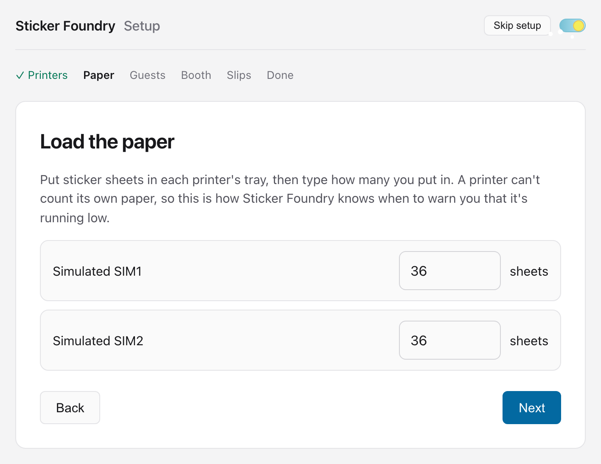
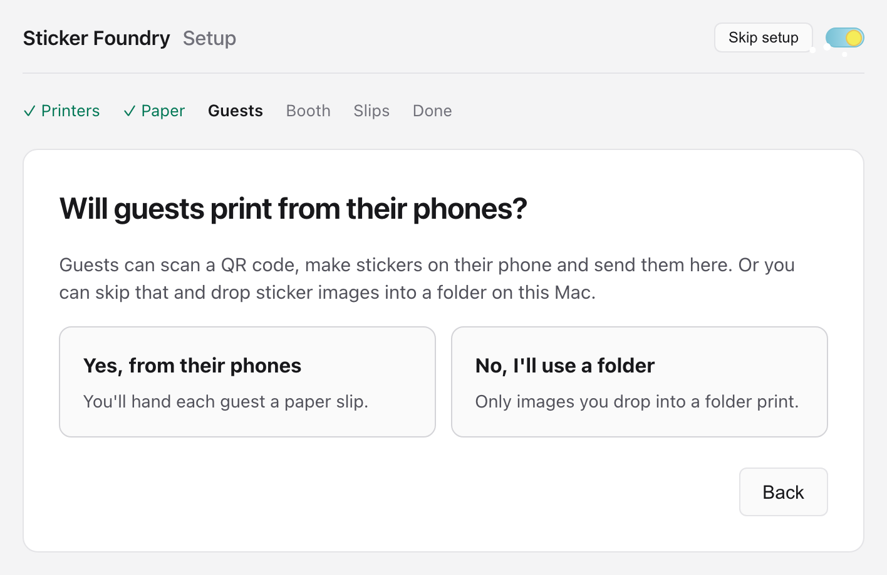
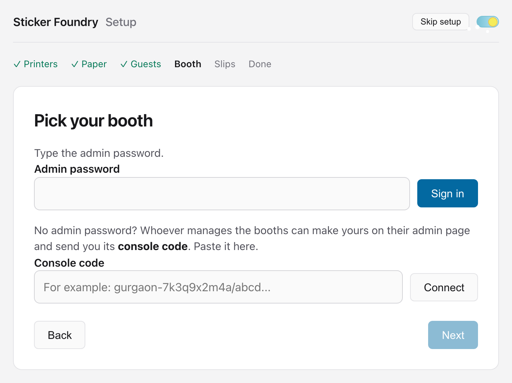
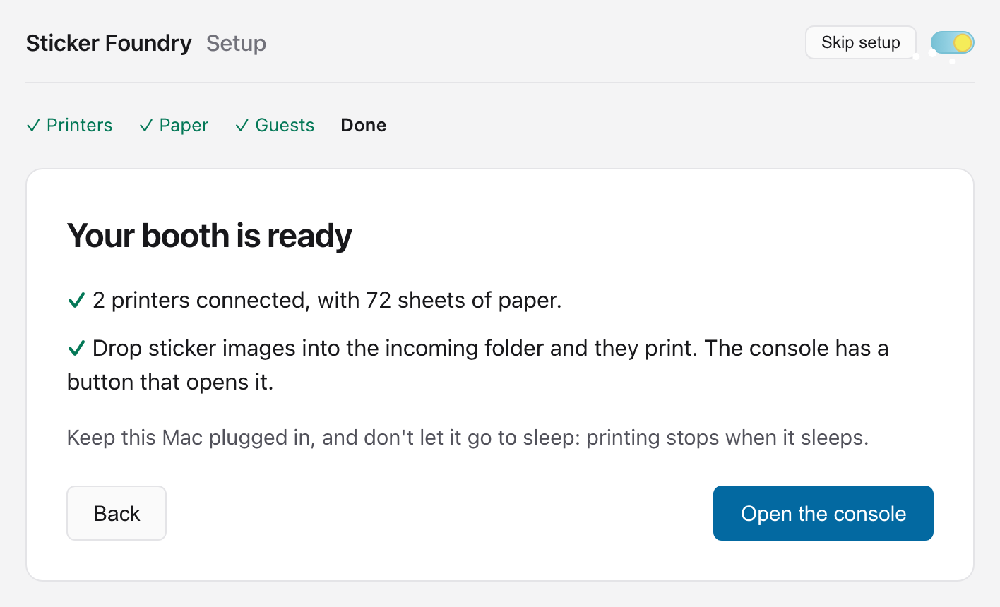
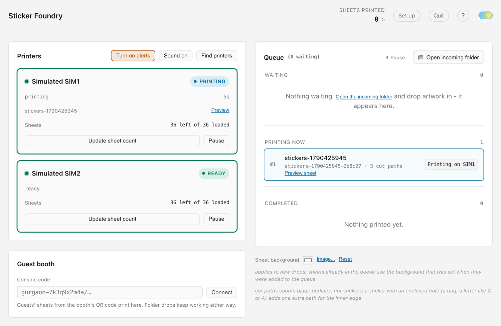
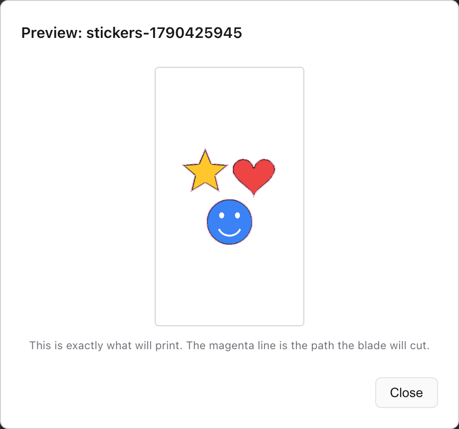
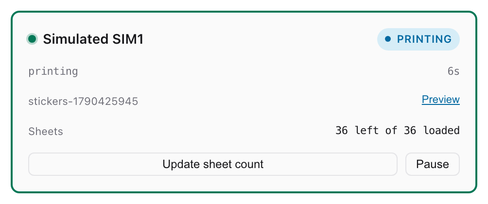

# Sticker Foundry: the complete guide

Everything you need to run a sticker booth with Sticker Foundry, from installing it to
the end of a busy day. No technical knowledge needed. Read sections 1 to 5 once before
your first event; keep the rest for when you need it.

## Contents

1. [What Sticker Foundry does](#1-what-sticker-foundry-does)
2. [What you need](#2-what-you-need)
3. [Install it](#3-install-it)
4. [The first time: the setup guide](#4-the-first-time-the-setup-guide)
5. [A tour of the console](#5-a-tour-of-the-console)
6. [Printing from a folder](#6-printing-from-a-folder)
7. [Guests printing from their phones](#7-guests-printing-from-their-phones)
8. [Running a booth day](#8-running-a-booth-day)
9. [The printer cards](#9-the-printer-cards)
10. [When a printer stops](#10-when-a-printer-stops)
11. [Held jobs: never reprint blind](#11-held-jobs-never-reprint-blind)
12. [The admin page](#12-the-admin-page)
13. [Setting up a booth for someone else](#13-setting-up-a-booth-for-someone-else)
14. [More printers, more booths](#14-more-printers-more-booths)
15. [Troubleshooting](#15-troubleshooting)
16. [Questions people ask](#16-questions-people-ask)
17. [Quitting, updating, resetting and getting help](#17-quitting-updating-resetting-and-getting-help)
18. [Words used in this guide](#18-words-used-in-this-guide)
19. [Photo prints](#19-photo-prints)
20. [The day report](#20-the-day-report)

---

## 1. What Sticker Foundry does

Sticker Foundry turns a Mac and one or more Bluetooth print-and-cut sticker printers into
a sticker booth. Each print is one 4 x 7 inch sheet: the printer prints it, then cuts
around every sticker so they peel off one by one.

Sheets reach the booth in two ways, and you can use either or both:

- **From a folder on the Mac.** Drop an image into the incoming folder and it prints. No
  internet needed.
- **From guests' phones.** A guest scans a QR code, makes stickers of themselves with
  Google's Gemini, types the code from their paper slip and presses send. The sheet
  prints at your booth.

```
 Guest's phone                     Your Mac                        Printer
 ─────────────                     ────────                        ───────
 scans the QR on their slip  ──►   Sticker Foundry           ──►   prints the sheet,
 makes stickers with Gemini        checks the slip code,           cuts round each
 types the code, presses Send      puts the sheet in line          sticker
                                          ▲
 or: you drop an image into the incoming folder
```

Everything goes into one queue: first in, first printed, on whichever printer is free.

**The one rule.** Every print uses one sheet of sticker paper and one panel of ink
ribbon, and neither can be used again. So Sticker Foundry asks before anything that
could spend a sheet, and it never reprints anything on its own.

---

## 2. What you need

| | |
|---|---|
| **A Mac** | macOS 12 or later. Apple Silicon (M1 or newer) or Intel: there is a download for each. Keep it plugged in. |
| **Printers** | One or more of your booth's Bluetooth print-and-cut sticker printers (ask whoever runs your booths which model). |
| **Paper and ribbon** | The printer's 4 x 7 inch sticker sheets and ink ribbon cartridges. A cassette holds **36 sheets**. Paper and ribbon run out together, so change them together. |
| **Internet** | Only if guests print from their phones. Folder printing works offline. |
| **A password or a code** | Only for guests' phones: the **admin password**, or a **console code** for your booth from whoever runs your booths. |
| **An office printer** | Only for guests' phones: to print the paper slips (A4 PDF, 20 slips a page). |

**Planning numbers**

| | |
|---|---|
| One sheet, drop to peel | about **2.5 minutes** per printer |
| Sheets per hour | about **22 per printer** (so about 44 with two) |
| One full cassette | 36 sheets, about **1.5 hours** of printing on one printer |
| Slips to print | about **1.5 per sheet** you have: slips get lost, and some people take one and never come back |

---

## 3. Install it

Follow the steps on the [download page](README.md#install-once-per-mac). In short:

1. Download **Apple Silicon** or **Intel**, whichever your Mac is. Not sure? Apple menu
   → **About This Mac**: "Chip: Apple M…" means Apple Silicon; "Processor: … Intel"
   means Intel.
2. Open the file and drag **Sticker Foundry** into **Applications**.
3. The first time, macOS stops it: press **Done**, then **System Settings** →
   **Privacy & Security** → **Open Anyway**. Once per Mac, and once per new version.
4. Allow **Bluetooth** when it asks.

### Or: install with one line

No disk image, and no Open Anyway step. Use it on a Mac that won't open disk images, or
just because it's quicker. Open **Terminal** (Applications → Utilities), paste this line
and press Return:

```
curl -fsSL https://github.com/BansalAakash/sticker-foundry-releases/releases/latest/download/install.sh | bash
```

It downloads the right version for your Mac's chip, checks it arrived whole, puts
**Sticker Foundry** in the **Applications folder inside your home folder**, and opens
it. It needs no admin password. Allow **Bluetooth** when it asks, and that's all.

To open it later, use Spotlight (⌘ Space, type *Sticker Foundry*) or, in Finder,
**Go** → **Home** → **Applications**.

### Once it's installed

Sticker Foundry opens in its own window: the **console**, your control panel. It has a
Dock icon and a menu bar like any Mac app.

- **Closing the window leaves the booth running**: printers keep printing and guests'
  sheets keep arriving. Click the Dock icon, the printer icon at the top right of the
  screen, or open Sticker Foundry again, to bring the window back. To make closing the window quit instead, untick **Sticker Foundry** →
  **Keep Running When Window Is Closed** in the menu bar.
- **⌘Q** quits Sticker Foundry, the same as **Quit** on the console.
- The **printer icon** at the top right of the screen, next to the clock, is there while
  Sticker Foundry runs, even with the window closed: **Show Console**, **Open in
  Browser** and **Quit Sticker Foundry**.
- **Sticker Foundry** → **Open in Browser** opens the console in your web browser too. To
  keep an eye on it from a phone or another computer on the same Wi-Fi, go to this Mac's
  address, e.g. `http://your-mac.local:8080`. The buttons only work on the Mac itself.

It keeps its files here:

| | |
|---|---|
| `Downloads/Sticker Foundry/incoming` | where you drop images to print |
| `Downloads/Sticker Foundry/processed` | images that printed |
| `Downloads/Sticker Foundry/errored` | images that could not be printed, each with a note saying why |
| `Downloads/Sticker Foundry/cancelled` | jobs you removed from the queue |
| `Downloads/Sticker Foundry/logs` | a record of the last 7 days, for when something goes wrong |

---

## 4. The first time: the setup guide

The first time Sticker Foundry opens, it shows a **setup guide** instead of the console.
It takes about five minutes and asks one thing at a time. The row along the top shows
where you are, with a tick on each finished step.



- **Skip setup** (top right) goes straight to the console. Everything the guide does can
  also be done from the console and the admin page.
- **Set up**, at the top of the console, brings the guide back at any time.

### Step 1: Printers

Switch each printer on, put it close to the Mac, and press **Search for printers**. The
search takes about 15 seconds. Sticker Foundry finds the printers, pairs them with the
Mac and connects them: there is no need to go into System Settings.



Each printer gets a row:

| The row says | What it means |
|---|---|
| **Connected** | Ready. |
| **Connecting...** | Pairing and connecting. The first time can take up to a minute. |
| **Not answering** | It has not connected after 90 seconds. Almost always it is switched off, or too far away. Switch it on, bring it closer, and press **Search for printers** again. |
| **Needs attention** | The printer reports a problem. See [section 10](#10-when-a-printer-stops). |

- **Bluetooth off?** A window pops up saying how to turn it on (the Bluetooth icon in the
  menu bar, or System Settings → Bluetooth). Apps can't switch Bluetooth on for you.
  Once it is on, press **Search again**.
- The search adds **every printer of this kind it can hear**, not only yours. At a venue
  with another sticker booth, ask them to switch theirs off while you search.
- The search is refused while a sheet is printing, because it would hold up the printer.
- **Next** opens once at least one printer says **Connected**.

### Step 2: Paper

Load sticker sheets into each printer's cassette, then type how many you put in.



**Count them.** A printer can't tell how much paper it has, so this number is all
Sticker Foundry knows. It counts down as sheets print and warns you when a printer runs
low. A printer showing 0 sheets gets no work, so nothing prints until you enter a count.
A full cassette is 36, but mid-event it's usually whatever is left of an opened pack.

### Step 3: Guests

Will guests print from their phones?



- **Yes, from their phones**: the guide goes on to your booth and the slips.
- **No, I'll use a folder**: you're done. Only images you drop into the incoming folder
  print.

### Step 4: Booth

A **booth** is one place where guests print, like "Bangalore office". It has its own QR
code, and its own rule for who may print (see [booth kinds](#booth-kinds)). This step
connects this Mac to one.



**With the admin password:** type it and press **Sign in**. You get a list of booths:

- Press a booth to connect this Mac to it. The one this Mac is connected to says
  **This Mac**.
- Or type a name under **Or create a new booth**, choose how guests get to print (**Open**,
  **Google sign-in** with how many sheets each, or **Slip codes**) and what they do
  (**Normal**, **Drop** or **Vibe**, with an optional **Theme** for Normal), and press
  **Create this booth**. It is created and connected in one go. Those choices can't be changed later.

**With a console code instead:** if someone else made your booth, they send you its
console code. Paste it under **Console code** and press **Connect**. It connects this Mac
to that one booth and nothing else.

When it works, the step says **This Mac prints for** *your booth*. If connecting fails,
the message says why. To try again, press the booth in the list: don't make it again, or
you'll have two booths with the same name.

### Step 5: Slips

Only for a **Slip codes** booth; the other kinds skip this step. Each guest needs a slip: a QR code to scan, and an 8-character code that is good for one
sheet.

- **How many slips?** The box suggests a number: one and a half for every sheet you
  loaded, rounded up to whole pages of 20.
- **Make slips and save to Desktop** makes the codes and saves a PDF named
  `slips-<booth>-<date>.pdf` to your Desktop. **Show in Finder** points to it. Print it
  on an ordinary printer and cut the slips apart.
- **Save a QR poster for the table** saves an A4 poster, `poster-<booth>-<date>.pdf`, with
  a big QR code and three steps for guests. Print it and stand it on the table.

Connected with a console code? Making slips needs the admin password, so this step tells
you to ask whoever gave you the code for the slips and the QR code.

### Step 6: Done



A summary of what's ready. Anything still missing is marked **!**. Press **Open the
console**.

---

## 5. A tour of the console



**Along the top**

| | |
|---|---|
| **Sheets printed** | How many sheets this booth has printed. The small ↻ sets it back to zero (it asks first, and there is no undo). |
| **Set up** | Opens the setup guide again. |
| **Quit** | Stops Sticker Foundry cleanly. See [section 17](#17-quitting-updating-resetting-and-getting-help). |
| **?** | A short help page. |
| **The sun/moon switch** | Light or dark. Your choice is remembered on every page. |

**Printers** (left)

| | |
|---|---|
| **Alerts** | In Sticker Foundry's own window, faults, low paper and printers going offline pop up as Mac notifications, even when the window is closed. Nothing to switch on. (In a web browser, press **Turn on alerts** once and allow notifications.) |
| **Sound on / Sound off** | A printer fault chimes until it is cleared. This mutes it. |
| **Find printers** | Keeps looking for printers you paired in System Settings, until you press it again to stop. For printers that were never paired, use **Set up** → **Search for printers**. |
| **Printer cards** | One per printer. See [section 9](#9-the-printer-cards). |

**Guest booth** (left, below the printers): which booth this Mac prints for. See
[section 7](#7-guests-printing-from-their-phones).

**Queue** (right)

| | |
|---|---|
| **Pause / Resume** | Stops sending sheets to every printer. Sheets already printing finish. |
| **Open incoming folder** | Opens the folder you drop images into. |
| **Held** | Only when something went wrong mid-print. See [section 11](#11-held-jobs-never-reprint-blind). |
| **Found in an old queue** | Only after a restart that found old jobs. See [section 11](#11-held-jobs-never-reprint-blind). |
| **Waiting** | Sheets in line. Each has **Preview sheet** and **Remove**. **Clear** removes them all (nothing has printed for them, so nothing is wasted, but guests' sheets are thrown away). If the line isn't moving, a note above it says why: the queue is paused, no printers have been found, or no printer is ready. |
| **Printing now** | Sheets on a printer right now, and which one. |
| **Completed** | Sheets that printed. **Clear** empties the list; the records stay on disk. |

**Sheet background** (under the queue): the colour, or an image, printed behind your
stickers. **Image...** picks a picture; **Reset** goes back to white. It applies to
images dropped from now on; sheets already in the queue keep the background they were
made with.

**At the bottom**: **Email logs** (see [section 17](#17-quitting-updating-resetting-and-getting-help)),
**Photo prints** ([section 19](#19-photo-prints)), **Day report** ([section 20](#20-the-day-report)),
**Admin** ([section 12](#12-the-admin-page)) and **Reset everything**. The version you
have is there too.

**Banners across the page**

| Banner | What to do |
|---|---|
| **Allow Bluetooth for Sticker Foundry** | macOS is asking whether Sticker Foundry may use Bluetooth: press **Allow**. No message showing? **System Settings** → **Privacy & Security** → **Bluetooth**, and switch **Sticker Foundry** on. macOS asks again after each update. The printers connect as soon as it's allowed. |
| **Bluetooth is off on this Mac** | Turn it on from the menu bar. The printers reconnect by themselves. |
| **The booth console has stopped working** | Press **Quit**, then open Sticker Foundry again. |
| **This console cannot see Bluetooth** | macOS isn't answering. Press **Quit**, then open Sticker Foundry again. Pairing the printers again won't help. |
| **Not connected to the booth server - nothing on this screen is live** | Sticker Foundry has stopped. Open it again. |

---

## 6. Printing from a folder

1. Press **Open incoming folder**.
2. Drop in a **PNG** or **JPG** image.
3. It appears in the queue within a few seconds and prints on the first free printer.
   The image moves to the `processed` folder.

**A dropped image prints: there is no "are you sure?".** To check a sheet before it
prints, press **Pause** on the queue first, drop the image, press **Preview sheet** on
it, then **Resume**.



The preview is exactly what will print. The magenta line is where the blade will cut.

### How an image becomes a sheet

- **One image makes one sheet.**
- **A transparent background** (a PNG with transparency) makes real stickers: every
  separate shape is its own sticker, cut around its outline. An image without
  transparency, including every JPG, is cut as one rectangle.
- **Size.** An image of exactly **1216 x 2128 pixels** (4 x 7 inches at 304 dpi) is used
  as the whole sheet. Any other size is scaled to fit and centred. Small images are
  enlarged, up to 4 times; anything that would still print smaller than **10 mm** is
  refused, because it would be too small to peel.
- **Keep stickers apart.** Shapes that touch are cut as one piece, so leave a gap between
  stickers: 2 mm is comfortable. Artwork whose stickers would cut as one lump is refused.
  Stickers under 1 mm apart print, with a warning to check the gaps.
- **Holes.** A shape with a hole in it (a ring, or a letter like O or A) gets a second
  cut for the inside edge. That's why a job can say more **cut paths** than it has
  stickers.
- **Full-size artwork:** keep cut lines off the last 0.7 mm of the left edge and 1.2 mm
  of the bottom edge, which the blade can't reach. Artwork cut there is refused.
- **A fully transparent image** (an empty export, say) is refused rather than printing a
  blank sheet.

**An image that can't be printed** moves to the `errored` folder, with a `.error.txt`
file beside it saying why. Fix the image and drop it in again.

---

## 7. Guests printing from their phones

### Booth kinds

Each booth is one of three kinds, chosen when it's made and never changed:

| Kind | What guests need | Limit |
|---|---|---|
| **Open** | Nothing: they scan the QR code and print. | None per person. **Pause** and **Max waiting** still work. |
| **Google sign-in** | To sign in with Google. | The sheets per person you chose (0 = no limit). The booth's Mac counts them. |
| **Slip codes** | An 8-character code from a paper slip you hand out. | One code, one sheet. Signing in stays optional. |

Booths made before booth kinds existed are **Slip codes** booths. The admin page shows
each booth's kind on its card.

### Booth modes

A booth also has a **mode**: what guests do once they're in. It is chosen when the booth
is made and never changed, like the kind. Any kind can have any mode, except that **Vibe**
can't be a **Google sign-in** booth.

| Mode | What guests do |
|---|---|
| **Normal** | Make stickers in the Sticker Foundry app. The only mode with a **Theme**. |
| **Drop** | Make a sticker sheet anywhere they like and upload it to the app. The app has no sticker maker, only the upload screen: a PNG with a transparent background, which it prints as it comes. |
| **Vibe** | Don't use our app at all. It gives them this booth's ID, the sheet rules and a prompt to paste into an AI coding tool, so they build their own app and print from it. At a Slip codes booth they still need a slip, and a slip still buys one sheet. |

In every mode the booth checks each sheet the same way and turns away ones it can't cut
safely. Booths made before modes existed are **Normal** booths.

### What the guest does

1. At a **Slip codes** booth, you hand them a **slip**.
2. They scan the QR code (on the slip, or the poster) with their phone camera. Sticker Foundry opens
   in their browser, already linked to your booth. Nothing to install.
3. They take a photo of themselves (or pick one).
4. Gemini makes stickers of them in different styles. They pick **up to 8** for their
   sheet, and can make more or describe their own.
5. They press **Print Stickers** and **Send Print**. At a **Google sign-in** booth they sign
   in with Google first; at a **Slip codes** booth they type the **8-character code**
   from their slip.
6. Their phone follows the sheet:

| The phone says | Meaning |
|---|---|
| **Sent to the booth** | In the queue. |
| **Printing now - head to the booth** | On a printer. |
| **Ready! Collect your sheet at the booth** | Printed. |
| **A printer needs a hand** | A printer needs you; their place in line is kept. |
| **Sheet was not printed** | The booth refused the sheet (see below). It didn't use up their code; they can adjust it and send again. |
| **Print cancelled** | You removed it from the queue. |

Guests can also **Sign in** with Google, at the top of the page. At Open and Slip codes
booths it's optional: it keeps a list of their sheets and how each one is doing. At a
**Google sign-in** booth it's required, and a guest who has used their sheets sees
**You've used all ... sheets this booth allows per person** (they can still save their
sheet to their phone).

### Slips and codes

For **Slip codes** booths only.

- Each code is **8 characters** and never uses O, 0, I, 1 or L, so it can't be misread.
- **One code, one sheet.** A used code says **This code has already been used**; a
  mistyped one says **This code is not valid**.
- The QR code is the same on every slip for a booth: it only says which booth. The code
  is what lets someone print, which is why guests have to be at the booth to get one.
- Make more slips on the admin page, under **Codes**. There you can also make **your own
  code**, which prints as many sheets as you like: keep it off the slips.

### What you see at the booth

- The **Guest booth** panel shows the booth's name and ID, and how many guest sheets have
  arrived. A **green dot** means it is working. A **red dot** says **Can't reach
  Firebase**: this Mac has lost the internet. Guests' sheets wait safely and arrive when
  it's back.
- Guest sheets join the **same queue** as folder images. **Remove**, **Pause**, held jobs
  and faults work exactly the same way.
- A guest sheet that would waste paper (blank, stickers touching, or too small) is
  refused before printing. It lands in the `errored` folder with the reason, the guest
  sees **Sheet was not printed**, and their code works again.
- **Disconnect** stops new guest sheets; anything already in the queue still prints.
  The booth is remembered when Sticker Foundry restarts.
- To connect by hand, paste a console code into **Console code** and press **Connect**
  (or use **Set up**).

### Limits and pausing

The booth's kind sets the limit per person (see [booth kinds](#booth-kinds)). At a
**Slip codes** booth, to let someone print again, hand them another slip. On the admin
page ([section 12](#12-the-admin-page)) you can also pause any booth (guests can't send
new sheets) and cap how many sheets may wait at once.

---

## 8. Running a booth day

### Before doors open (about 15 minutes)

- [ ] Mac plugged in, lid open, **Bluetooth on**.
- [ ] Printers plugged into the mains (not a battery pack), within a couple of metres of
  the Mac, nothing metal in between.
- [ ] Each printer loaded with paper **and** a ribbon cartridge, cassette pushed fully in.
- [ ] Each printer's sheet count entered (**Update sheet count** on its card).
- [ ] Every printer card green and **Ready**.
- [ ] The queue empty, with nothing **Held**.
- [ ] The sound on (**Sound on** on the Printers panel).
- [ ] For guests' phones: the **Guest booth** dot green, slips printed and cut, the poster
  on the table.

### Refilling a printer

1. Press the printer's **Pause**. It says **Pausing after this job...** while it finishes
   the sheet in hand, then **Paused - safe to open**.
2. Open it. Replace the paper cassette **and** the ribbon cartridge. Push the cassette in
   until it latches: a cassette that isn't latched behaves like an empty one.
3. Close it and wait for it to be ready.
4. Press **Update sheet count** and enter the number of sheets you put in.
5. Press **Resume**.

Other printers keep printing the whole time. With two printers, refill one at a time.

**Low paper.** At **5 sheets** left, Sticker Foundry sends a "low on paper"
notification. That's the moment to fetch the next
cassette and ribbon, not to start looking for them. At 0, the card says **Refill
sheets** and the printer gets no more work.

### During the day

- **Stop everything:** **Pause** on the queue. Sheets already printing finish.
- **Remove a sheet:** **Remove** on its row in **Waiting**. Nothing is printed or used.
- **Check a sheet:** **Preview** on a printer card, or **Preview sheet** on any row.
- **Watch the queue.** 20 people waiting with two printers is about 25 minutes. Tell
  people how long it'll be.
- **Keep the Mac awake.** Sticker Foundry keeps it from dozing off, but closing the lid
  or unplugging it on low battery still puts it to sleep, and printing stops until
  someone wakes it.

### At the end of the day

1. **Pause** the queue and let anything printing finish.
2. Decide every **Held** job (section 11) while you can still look at the printer.
3. Press **Quit**.
4. Count the sheets left in each cassette and write them down. The console remembers its
   own count, but that is only arithmetic: tomorrow, enter what you actually count.
5. Switch the printers off.

For a new event with the same booth, change its name under **Edit** on the admin page,
make a fresh batch of slips if it's a Slip codes booth, and press the ↻ next to
**Sheets printed** to start the count from zero. A theme can't be changed once the booth
exists, so if the new event needs a different theme, make a new booth for it.

---

## 9. The printer cards



Each card shows the printer's name, a dot for whether the Mac has a live link to it, its
status, the sheet it's printing (with **Preview**), and **Sheets: X left of Y loaded**.
Its two buttons are **Update sheet count** and **Pause** / **Resume**.

**Colours, readable from across the room**

| Border | Meaning |
|---|---|
| **Green** | Ready or printing. |
| **Yellow** | Paused by you. |
| **Red** | Needs you: the card says what to do. |
| **None** | Connecting, offline, Bluetooth off, or waiting for a sheet count. |

**What the status says**

| Status | Meaning |
|---|---|
| **Ready** | Idle and waiting for work. |
| **Uploading...** | Sending a sheet to the printer, a few seconds. Only one printer uploads at a time, so a short wait is normal. |
| **Printing** | Printing. Don't open it. |
| **Cutting** | The blade is moving. Keep fingers out of the slot. |
| **Pausing after this job...** | You pressed Pause; it finishes this sheet first. |
| **Paused - safe to open** | Paused and idle. Safe to refill. |
| **Photo paper - photos only** | Switched to photo paper on **Photo prints**, so it takes no sticker sheets. See [section 19](#19-photo-prints). |
| **Refill sheets** | Its count reached 0. Load paper, then **Update sheet count**. |
| **Connecting...** | Reaching the printer. It keeps trying by itself, less often the longer it takes. |
| **Offline** | It was connected and dropped. Check it's on and close by. |
| **Bluetooth off** | Bluetooth is off on the Mac. Turn it on. |
| **Fault - Check Printer** | Stopped. See the next section. |

While a printer is connected, Sticker Foundry stops it from switching itself off during a
quiet spell. If one drops off anyway, something switched it off, unplugged it, or moved
it out of range.

---

## 10. When a printer stops

**Always go and look at the printer first.** It can't report paper, ribbon or a sheet
stuck in the slot: only you can see those.

A stopped printer's card turns red and shows a headline, what to do, and one button. The
printer is out of the line-up until you press that button. Every other printer keeps
going.

| Headline | What to do |
|---|---|
| **Out of paper** | Load sheets, push the cassette fully in, press **I loaded paper** and type how many went in. The sheet it was printing hadn't used any paper and is already back in the queue. |
| **No paper tray** | The cassette is missing or not latched. Put it in properly, then as above. |
| **No ink ribbon** / **Ink ribbon used up** | Fit a new ribbon cartridge, close the printer, press **I fitted a ribbon cartridge**. |
| **This printer has stopped and needs attention** | Usually a jam. Press **Pause** on the queue, switch the printer off before reaching in, and pull the stuck sheet out the way it was travelling (don't tear it). Check the ribbon and cassette are seated, close it, switch it on, then press **I checked this printer: clear fault**. |

- **"DO NOT reload paper yet"** on a card means the printer is still holding a sheet it
  would print the moment paper goes in. Switch the printer off and on again first, then
  load paper.
- **Never clear a fault just to make the red go away.** The button only tells the
  console you've looked; if the problem is still there, the next guest's sheet goes the
  same way.
- **Never switch a printer off while it's printing**, except to clear a jam.
- If a sheet was on the printer when it stopped, it may appear under **Held**: see the
  next section.

---

## 11. Held jobs: never reprint blind

A job is **held** when Sticker Foundry can't know whether the printer used a sheet: the
connection dropped mid-print, the printer stopped mid-print, or the Mac was switched off
mid-print. It doesn't guess and it never reprints by itself: it puts the job under
**Held** for you to decide.

Go to the printer and look at the output tray and inside:

| What you see | Do |
|---|---|
| A complete, properly cut sheet | **Discard** the held job, and hand the guest their sheet. |
| A half-printed sheet, or colours missing | **Reprint**: a sheet was used and it's no good. |
| A jammed or torn sheet | Clear the jam first ([section 10](#10-when-a-printer-stops)), then **Reprint**. |
| Nothing at all, and the paper stack unchanged | **Reprint**. |
| You really can't tell | Ask the guest if they still want it. If paper is short, **Discard**. |

**Reprint** asks you to confirm, because it uses another sheet. The reprint goes to the
front of the queue. Clear the printer's fault first, or the second sheet goes the same
way as the first.

While you decide, tell the guest what's happening. "The printer stopped half-way, I'm
checking whether your sheet came out" takes ten seconds.

### Found in an old queue

If Sticker Foundry starts and finds jobs left over from more than two hours ago, it
doesn't print them by itself: nobody is likely to be waiting any more. They appear under
**Found in an old queue**, with **Approve (1 sheet)**, **Discard** and **Preview
sheet**. Nothing has been used yet. Usually **Discard** is right.

---

## 12. The admin page

The admin page manages every booth: it makes booths, slips and QR codes, and sets the
rules for guests. Open it with **Admin** at the bottom of the console: it opens as a
pop-up on top of the console, and **Close** at the top puts it away. (In a browser it is
also a page, at http://localhost:8080/admin.) Sign in with the admin password. You stay signed in until
you close the window or press **Sign out**.

**New booth.** Type a name, choose **how guests get to print** and **what guests do**,
and press **Create booth**:

- **Open** (the default): anyone with the QR code prints.
- **Google sign-in**: guests must sign in with Google. Set **Sheets per person** from 0
  to 20 (0 = no limit).
- **Slip codes**: each guest needs a code from a paper slip, one per sheet.

And what they do (see [booth modes](#booth-modes)):

- **Normal** (the default): guests make stickers in our app. Optionally give it a
  **Theme**: a sentence about the event, e.g. *Diwali: diyas, rangoli, fireworks, sweets*.
  Every sticker guests make is made to fit it, or tick **Only some stickers** for about
  half themed and the rest the usual mix. Leave it empty for the usual mix of stickers.
- **Drop**: guests make a sheet elsewhere and upload it. No sticker maker, and no theme.
- **Vibe**: guests build their own app from a prompt we give them. No theme. Not available
  with Google sign-in: the two grey each other out.

None of this can be changed once the booth exists; make a new booth if you need a
different kind, mode or theme (see [booth kinds](#booth-kinds)). Each booth gets an ID made
from its name plus random letters, like `bangalore-office-7k3q9x2m4a`.

**Booths.** One card per booth, refreshed on its own (or press **Refresh**):

| On the card | Meaning |
|---|---|
| **Online** / **Offline** | Whether the booth's Mac is running Sticker Foundry and connected right now. An offline booth shows **Last seen**: when it was last heard from. |
| **Paused** | Guests can't send new sheets. |
| **Printers ready**, **Waiting**, **Printed** | Live from the booth's Mac. |
| **Max waiting** | How many sheets may wait before guests are asked to wait. |
| **Guests** | The booth's kind: Open, Google sign-in (with sheets per person), or Slip codes. Fixed when the booth was made. |
| **Mode** | Normal, Drop or Vibe. Fixed when the booth was made. A Normal booth with a theme shows it under the card. |
| The booth ID, with **Copy** | The ID is on every slip, so it isn't secret. |
| **Copy console code** | What connects a Mac to this booth. Keep it private. (A booth made before console codes existed shows **Make console code** instead.) |

**The buttons on a booth card**

- **Edit**: the kind, mode and theme are shown but can't be changed.
  - **Name**: guests see it at the top of the app, so the event's name works well (e.g.
    *Diwali at Hyderabad*).
  - **Sheets each device may send** (Open booths only; 0 = no limit): a soft limit. Each
    phone or laptop browser may send this many sheets, then it is asked to stop. It is soft
    because a guest who opens a new browser or a private window starts again. For a firm
    limit, use a Slip codes booth. A sheet the booth turns away doesn't count.
  - **Paused**: guests can't send new sheets.
  - **Max sheets waiting before guests are asked to wait** (0 = unlimited): keeps the line
    from growing longer than your printers can manage.
- **Pause** / **Resume**: the same as the Paused box, in one click.
- **Codes** (for Slip codes booths)
  - **How many slips to make**, then **Make slips**. The new batch appears under
    **Slips made**, with **Save PDF**, **Print**, **Print as stickers**, **Save as text**
    and **Count used** (how many of that batch have been used). Batches are kept, so you
    can print them again later.
  - **Print as stickers** prints the codes on a sticker sheet, on one of your printers,
    instead of paper: 33 codes to a sheet, each its own small sticker in the guest app's
    colours, with the AI Studio and Gemini logos and "Good for one sticker sheet". Choose the printer if you have more than one, and which sheet if the batch
    needs more than one (a batch of 60 is two sheets), then press **Print sheet**. Each
    press prints one sheet and also saves it as a PDF on your Desktop. The printer must
    be ready: if it is printing, paused, out of sheets, has photo paper in or needs
    attention, you're told at once and nothing prints. The sheet uses one of that
    printer's sheets, like any other, and doesn't wait in the guests' queue. The stickers
    don't carry the QR code, so keep the booth's QR up at the table.
  - **Your own code**: **Make one** for a code that prints as many sheets as you like,
    and **Stop this code** to retire it. Keep it off the slips.
  - **Open slips folder** shows saved slip PDFs.
- **QR code**: the booth's QR code, with **Save QR as PNG** and **Print**, for a sign at
  the booth. Scanning it opens the guest app. At a Slip codes booth, printing still needs
  a slip code.
- **Delete**: type the booth's name to confirm. Its QR code stops working and its Mac can
  no longer connect; sheets already printed aren't affected. This can't be undone. If the connection drops halfway through, the booth is off your list at once and the admin page finishes removing it the next time it loads.

---

## 13. Setting up a booth for someone else

You can run someone else's booth without giving them the admin password:

1. On the admin page, **Create booth** with their location's name.
2. On its card, press **Copy console code** and send them the code.
3. Under **Codes**, make their slips and press **Save PDF**. Send them the PDF.
4. Under **QR code**, press **Save QR as PNG** and send them the picture for their table.
5. Send them the [download page](README.md). They install Sticker Foundry and, in the
   setup guide's Booth step, paste the console code under **Console code**.

The console code connects their Mac to that one booth and nothing else: it can't sign in
to the admin page, see other booths or change settings. From your admin page you can
still see their booth, pause it, and change its limits.

---

## 14. More printers, more booths

**More printers.** A booth can run any number of printers: each one is another outlet
for the same queue, and a sheet goes to whichever printer is free (the one with more
paper left, if several are). To add one, switch it on near the Mac and press **Set up** →
**Search for printers**. A printer that stops answering keeps its card and its sheet
count until it comes back.

**More booths.** Each location is its own booth, with its own QR code, slips, codes and
limits, and its own Mac. Make them on the admin page. Every booth's card on the admin page
shows whether its Mac is online and what it has printed.

**One Sticker Foundry per Mac.** Opening it again only brings the console back; it never
starts a second copy.

---

## 15. Troubleshooting

### Installing and opening

| Problem | Fix |
|---|---|
| "Sticker Foundry Not Opened" | Normal the first time. Press **Done**, then **System Settings** → **Privacy & Security** → **Open Anyway**. See the [download page](README.md#install-once-per-mac). |
| No **Open Anyway** button | Double-click the app again, then look again: it only shows for a while after macOS stops the app. |
| macOS says the app isn't supported on this Mac, or it quits at once | You have the other chip's download. Check Apple menu → **About This Mac** and download the one for your Mac. |
| "another program is using port 8080" | Something else is using the console's address, often an old copy of Sticker Foundry. Quit it (or restart the Mac), then open Sticker Foundry again. |
| "Sticker Foundry stopped because of a problem" | Press **Email logs** in that message and send the email (see [section 17](#17-quitting-updating-resetting-and-getting-help)). |
| The console page doesn't open | Open Sticker Foundry again: it brings the page back. Or go to http://localhost:8080. |
| The disk image won't open, or you're not allowed to add apps to Applications | Use the [one-line install](#or-install-with-one-line) instead. It needs no disk image and no admin password. |
| The one-line install says "Sticker Foundry is open" | Press **Quit** at the top right of the console, then run the line again. |
| The one-line install says it "could not download" or the download "is damaged" | Check the internet connection and run the line again. |
| You can't find the app after the one-line install | It's in the Applications folder inside your home folder: in Finder, **Go** → **Home** → **Applications**. Or use Spotlight. |

### Setting up

| Problem | Fix |
|---|---|
| The setup guide didn't appear | Press **Set up** at the top of the console. |
| Sticker Foundry never asked about Bluetooth, you pressed **Don't Allow**, or a banner says **Allow Bluetooth for Sticker Foundry** | **System Settings** → **Privacy & Security** → **Bluetooth**, and switch **Sticker Foundry** on. The printers connect as soon as it's allowed. |
| A "Turn on Bluetooth" window | Turn Bluetooth on from the Bluetooth icon in the menu bar (or System Settings → Bluetooth), then press **Search again**. |
| **Next** is greyed out on the Printers step | At least one printer has to say **Connected**. See the Printers table below. |
| "A printer is printing" when you search | The search waits for printing to finish, so it doesn't hold a sheet up. Try again in a couple of minutes. |
| **Wrong password.** | Type it again, minding capitals. If you don't have it, ask for a console code instead. |
| "That is not a console code" | Copy the whole code again: the booth ID, a slash, then 20 letters and numbers. |
| "That is the booth ID on its own" | You pasted only the first half. Copy the whole console code (**Copy console code** on the admin page). |
| "Firebase refused" or "Can't reach Firebase" | Check the Mac's internet, then try again. If the password changed, sign in again. |
| "Could not connect this Mac" | The booth was probably made anyway. Press it in the list to connect, rather than making it again. |
| "Only 40 of the 60 could be made" (or other numbers) | Keep the PDF, and press **Make slips** again for the rest. |
| You can't find the slips PDF | It's on your Desktop, named `slips-<booth>-<date>.pdf`. **Show in Finder** points to it. |

### Printers

| Problem | Fix |
|---|---|
| **Search for printers** finds nothing | Is the printer on? Is it close to the Mac? Is Bluetooth on? Try again. |
| **Not answering** in the setup guide | Switch the printer on (it may have switched itself off), bring it close, and search again. |
| A card stuck on **Connecting...** or **Offline** | Check it's on and close by. Another app or another Mac connected to it locks Sticker Foundry out: quit that app properly (don't force-quit). Then press **Find printers**, or **Set up** → **Search for printers**. |
| **Bluetooth off** | Turn Bluetooth on from the menu bar. |
| Nothing prints, and the cards say **Refill sheets** | Enter a sheet count with **Update sheet count**. |
| A printer never gets any work | Is it paused (yellow)? Faulted (red)? Showing 0 sheets? |

### Printing

| Problem | Fix |
|---|---|
| A dropped image never appeared in the queue | Look in the `errored` folder: the `.error.txt` beside it says why. |
| Sheets sit in **Waiting** | The note above the list says why: the queue is paused, no printers found, or no printer ready. |
| Stickers came out as rectangles | The image has no transparent background. Save it as a PNG with transparency. |
| Two stickers cut as one | They touch or nearly touch. Move them apart (about 2 mm). |
| A sheet printed on the wrong background | The background applies to images dropped after you set it. |

### Guests' phones

| Problem | Fix |
|---|---|
| The **Guest booth** dot is red | This Mac has no internet. Guests' sheets wait and arrive when it's back. |
| "This QR code isn't linked to a booth" | The guest scanned something other than your slip or poster. |
| "This code is not valid" | A typo. Codes never use O, 0, I, 1 or L. |
| "This code has already been used" | Each code prints one sheet. Give them a new slip. |
| "Sheet was not printed" | The sheet would have wasted paper (blank, stickers touching or too small). The code still works; they can adjust and send again. |
| Guests' sheets aren't arriving | Is the booth **Paused** on the admin page? Is the Mac connected (green dot)? Is the booth **Online** on the admin page? |
| "Could not connect this Mac" when making a booth | The booth was probably made. Press it in the list to connect, rather than making it again. |

### The console

| Problem | Fix |
|---|---|
| **The booth console has stopped working** | Press **Quit**, then open Sticker Foundry again. |
| The page looks frozen or out of date | If a banner says **Not connected to the booth server**, open Sticker Foundry again. |
| Printing stopped while the Mac was idle | The Mac went to sleep. Wake it; keep it plugged in with the lid open. |
| **Update now** says a printer is printing | Wait for it to finish (or pause the queue and let it finish), then press **Update now** again. |
| After **Update now**, the console didn't come back | Open Sticker Foundry from Applications. What happened is in the logs folder, in `sticker-foundry-update.log`. |
| **Email logs** opened the wrong browser | It uses Chrome when it is installed, and your usual browser when not. |

### Photo prints

| Problem | Fix |
|---|---|
| Photos wait and nothing prints | No printer is set to photo paper. On **Photo prints**, press **Use for photos** on a printer with photo paper in it. |
| A photo is in `photos/check` | The console lost track of it while it printed. Look at what came out; drop it in again only if it didn't print. |
| A file went to `photos/errored` | It isn't a picture Sticker Foundry can read. The note beside it says why. Save it as JPEG or PNG and drop it in again. |
| Sticker jobs stopped after I switched a printer to photos | Every printer is on photo paper. Switch one back with **Back to stickers**. |

---

## 16. Questions people ask

### Setting up

**Do I need an account to install it?**
No. Download it from the download page, no sign-in needed. The internet is only needed
to download it and, on the day, for guests printing from their phones.

**Can I install it without the disk image?**
Yes: the [one-line install](#or-install-with-one-line) in Terminal. It picks the right
chip for you and skips the Open Anyway step. Running the same line again updates it.

**Can it print photos?**
Yes: 4 x 6 inch photos on photo paper, kept apart from the stickers. See
[section 19](#19-photo-prints).

**Can I see how the day went?**
Yes: **Day report** at the bottom of the console. See [section 20](#20-the-day-report).

**How do I update it?**
Press **Update now** when the console says a newer version is out. See
[section 17](#17-quitting-updating-resetting-and-getting-help).

**Apple Silicon or Intel?**
Apple menu → **About This Mac**. "Chip: Apple M1" (or M2, M3...) means Apple Silicon.
"Processor: ... Intel" means Intel.

**macOS says it can't check the app for malware. Is it safe?**
macOS says that about any app whose maker isn't registered with Apple, which costs a
yearly fee. If you downloaded it from the download page, it's the real app. Allow it
once with **Open Anyway** (see [section 3](#3-install-it)).

**Do I have to pair the printers in System Settings?**
No. **Set up** → **Search for printers** pairs them for you. Pairing in System Settings
works too; then press **Find printers** in the console.

**How close does a printer need to be?**
Within a couple of metres of the Mac, ideally with nothing metal in between.

**How many printers can I use?**
As many as you like. Each one takes sheets from the same queue.

**Which browser?**
None needed: the console opens in Sticker Foundry's own window. **Open in Browser** (in
the Sticker Foundry menu) opens it in any up-to-date browser too.

**What paper and ink?**
Your printer's own 4 x 7 inch sticker sheets and ink ribbon cartridges. Change the paper
and the ribbon together.

### Printing

**Can I close the window?**
Yes: printing carries on, and the window comes back when you click the Dock icon, the
printer icon next to the clock, or open Sticker Foundry again. Alerts still reach you as
Mac notifications while it's closed. (If you've unticked **Keep Running When Window Is
Closed**, closing the window quits instead.)

**Can I use the Mac for other things meanwhile?**
Yes. Just don't quit Sticker Foundry, close the lid, or let it run out of battery.

**What makes a good sticker image?**
A PNG with a transparent background, 1216 x 2128 pixels for a full sheet, with each
sticker at least 10 mm across and about 2 mm of empty space between stickers. See
[section 6](#6-printing-from-a-folder).

**How do I print the same image twice?**
Drop it in again. Each image dropped is one sheet.

**Can I cancel a sheet?**
While it's waiting: **Remove**, and nothing is used. Once it's printing it can't be
stopped safely: never switch the printer off mid-print.

**How do I know how much paper is left?**
Each printer card says **Sheets: X left of Y loaded**. That's counted, not measured: it
starts from the number you entered and goes down by one per sheet. The ribbon isn't
counted at all, which is why you change it with the paper.

**Why did a printer's count go down for a sheet that didn't print?**
When a sheet is held (the printer stopped mid-print), Sticker Foundry assumes the sheet
was used, so it never promises paper that isn't there. If you find the sheet wasn't used,
correct the count with **Update sheet count**.

**What happens if the Mac loses the internet?**
Folder printing carries on. Guests' sheets wait, safely, and arrive when the internet is
back. Nothing is lost.

**What happens if the Mac restarts or the power goes?**
Open Sticker Foundry again. The queue is remembered. A sheet that was printing at that
moment appears under **Held** for you to decide ([section 11](#11-held-jobs-never-reprint-blind)).

**What happens if a printer is switched off, or goes out of range?**
Its card says **Offline** and it keeps trying to reconnect. Nothing is sent to it
meanwhile; other printers carry on. A sheet it was printing may appear under **Held**.

### Guests

**Do guests need an app or an account?**
No. They scan the QR code and it opens in their phone's browser. They sign in with Google
only at a Google sign-in booth.

**Can a guest print more than once?**
At a Slip codes booth, one code prints one sheet, so for another, give them another slip.
At a Google sign-in booth, as many as the booth allows each person; at an Open booth, as
many as they like.

**A guest lost their slip.**
Give them a new one. Their unused code simply goes unused.

**Can I stop guests sending sheets for a while?**
Yes: **Pause** on the booth's card on the admin page. Or cap the queue with **Max sheets
waiting**.

**We're starting a new event. What do I reset?**
Change the booth's name under **Edit** on the admin page. A theme is fixed when the booth
is made, so for a different theme make a new booth. At a Slip codes booth, make a fresh
batch of slips: codes already used stay used. At a Google sign-in booth, each guest's
count lasts as long as the booth, so for fresh counts make a new booth. An Open booth
has nothing to reset.

**A guest wants another sheet. How?**
At a Slip codes booth, hand them another slip, or type your own unlimited code for them.
At a Google sign-in booth the limit is fixed; an Open booth has none.

**Can I change a booth from Open to Slip codes (or the other way) later?**
No: what a booth asks of guests is fixed when it's made, so guests always know what to
expect. Make a new booth of the kind you need.

### Booths and passwords

**Can one Mac print for two booths?**
No, one booth at a time. Use one Mac per booth.

**Can two Macs share a printer?**
No. A printer talks to one Mac at a time.

**I lost the admin password.**
Ask whoever runs your booths. Sticker Foundry can't show it or reset it. Slips already
printed keep working.

**I lost the console code.**
Anyone with the admin password can copy it again: **Copy console code** on the booth's
card.

**Who can see the console?**
Anyone at this Mac, and anyone on the same Wi-Fi who knows its address: the console has
no password. From another device it can only be watched; its buttons work only on the
Mac itself. On a public or shared network, use a private one if you can (a phone
hotspot works), and don't leave the Mac unattended where a guest could press things.

**Can I check the booth from my phone?**
Yes, on the same Wi-Fi, to watch it (the buttons only work on the Mac). Find the Mac's name in **System Settings** → **General** →
**Sharing**, at the bottom (it ends in `.local`, for example `Booth-Mac.local`). On your
phone, open `http://Booth-Mac.local:8080` with your Mac's name in place of `Booth-Mac.local`.

**How do I start completely fresh?**
**Reset everything** at the bottom of the console ([section 17](#17-quitting-updating-resetting-and-getting-help)).

---

## 17. Quitting, updating, resetting and getting help

**Quit.** Press **Quit** at the top right, or **⌘Q**. Printers are disconnected cleanly
and the window closes. While a printer is printing it won't quit: the sheet in it is
already paid for, so wait for it to finish. Never force-quit Sticker Foundry while it's
printing.

**Open it again** from Applications. The queue, sheet counts, booth and settings are all
remembered.

**Updating.** When a newer version is out, a line at the top of the console says so.
Wait until nothing is printing, then press **Update now**. Sticker Foundry downloads the
new version, checks it, quits, puts it in place (the old one goes to the Trash) and opens
again by itself, usually within half a minute. Your queue, counts, booth and settings are
kept. macOS may ask you to allow Bluetooth again: press **Allow** (until you do, a banner
says **Allow Bluetooth for Sticker Foundry**). **What's new** lists
the changes. The version you have is at the bottom of the console.

If **Update now** isn't offered, the line says why: most often Sticker Foundry is running
straight from the disk image, so drag it into Applications and open it from there. You
can always update by hand too: download the new version from the same page and drag it
into Applications, replacing the old one (macOS stops a new version once, like the first
time: **Done**, then **Open Anyway**). Installed with the
[one line](#or-install-with-one-line)? Press **Quit**, then run the same line again.

**Reset everything** (at the very bottom of the console) puts Sticker Foundry back to how
it was on day one: no jobs, no remembered printers, no sheet counts, no booth, no
settings. It keeps the logs and the Mac's Bluetooth pairings. It asks twice (the second
time you type RESET), and it refuses while a printer is printing. Nothing is deleted:
everything is moved into folders named `_archive-<date>-reset`. (The newest five are
always kept; older ones go to the Trash after a month.)

**Getting help.** At the bottom of the console, press **Email logs**. Gmail opens in
Chrome with a message ready, addressed to the person who looks after Sticker Foundry, with
the latest errors from this Mac already in it. Add what you saw and roughly when, then
press **Send**. Nothing is sent until you do. No Chrome? Gmail opens in your usual browser
instead.

If Sticker Foundry ever stops because of a problem, it says so in a message with an
**Email logs** button that does the same.

---

## 18. Words used in this guide

| Word | Meaning |
|---|---|
| **Admin page** | Where booths, slips and QR codes are made. Needs the admin password. |
| **Booth** | One place where guests print, with its own QR code, slips and limits. |
| **Cassette** | The printer's paper tray. Holds 36 sheets. |
| **Code** | The 8 characters on a slip, good for one sheet. |
| **Console** | Sticker Foundry's window: your control panel. |
| **Console code** | What connects a Mac to one booth: the booth's ID, a slash, then a key. Keep it private. |
| **Cut path** | One line the blade cuts. A sticker with a hole has two. |
| **Held** | A job that stopped mid-print, waiting for you to decide. |
| **Incoming folder** | Where you drop images to print. |
| **Queue** | The line of sheets waiting to print, first in, first out. |
| **Ribbon** | The printer's ink cartridge. One panel per sheet. |
| **Setup guide** | The step-by-step page that opens the first time, and under **Set up**. |
| **Sheet** | One 4 x 7 inch sheet of sticker paper: one print. |
| **Slip** | A paper slip for a guest, with the booth's QR code and a code. |
| **Photo paper** | 4 x 6 inch paper for photos. A printer switched to it prints only photos. |
| **Photos folder** | Where you drop pictures to print as photos. |

---

## 19. Photo prints

The printers also print **4 x 6 inch photos** on photo paper. Photos are kept apart from
the stickers: they have their own folder and their own page, and a printer is either on
sticker sheets or on photo paper, never both. Nothing about guests, booths or slips
applies to photos.

**To print photos:**

1. At the bottom of the console, press **Photo prints**.
2. Pick a printer. Take the sticker sheets out, load **photo paper** (and a ribbon if it
   needs one), then press **Use for photos** on it and say how many sheets you loaded.
   That printer stops taking sticker jobs; your other printers keep printing stickers.
   With only one printer, sticker jobs wait until you switch it back.
3. Press **Open photos folder** and drop pictures in. They print one after another,
   oldest first. JPEG, PNG and iPhone HEIC photos all work.

Each photo is turned and cropped to fill the whole sheet, the way photo-printing apps usually
do: a landscape picture is turned on its side, and anything that doesn't fit 4 x 6 is
trimmed from the edges. The white strip at each end of the paper tears off.

**The photo page shows** where the folder is, each printer and its paper, and what is
printing, waiting and done. **Update count** changes a printer's sheet count without
changing its paper.

**When you're done**, press **Back to stickers**, put the sticker sheets back and say how
many. The printer rejoins the sticker queue.

**Where photos go** (inside the photos folder):

| Folder | What's in it |
|---|---|
| `printed` | Photos that printed. |
| `check` | Photos the console lost track of while printing. Look at what came out before dropping one in again: it is never printed twice by itself. |
| `errored` | Files that aren't pictures Sticker Foundry can read, each with a note saying why. |

---

## 20. The day report

Press **Day report** at the bottom of the console for a summary of a day at the booth:

- sticker sheets and photos printed, and where the sticker sheets came from (guests'
  phones or the incoming folder);
- when printing started and ended, the busiest hour, and a chart of prints per hour;
- each printer: stickers, photos, held jobs and stops;
- what went wrong: held jobs (each counted as having used a sheet, because nobody can
  tell), printer stops, and files that couldn't be used;
- jobs removed before printing and held jobs reprinted or discarded.

Pick another day from the list at the top. **Save as PDF** opens the print window, where
you can save the report as a PDF or print it. The counts come from what the console sent
and saw finish; the printers report no paper or ribbon levels. Days start from when your
Mac got version 1.6.0.
