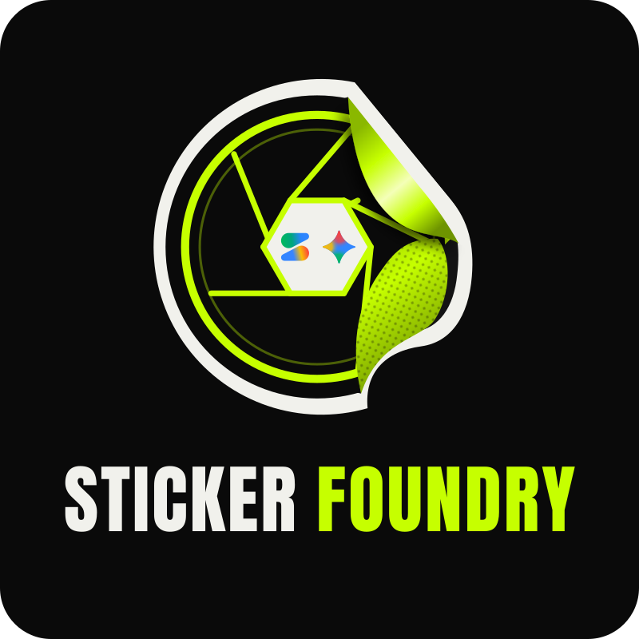

<p align="center">
  
</p>

# Sticker Foundry

Print and cut stickers at your booth. Guests make stickers with Google's Gemini on
their phones, or you drop images into a folder. A Mac at the booth prints each sheet on
Bluetooth print-and-cut sticker printers, which print it and then cut round every
sticker, ready to peel.

You don't need to know how to code. Download it, follow the setup guide it opens, and
you're printing. **[The complete guide](GUIDE.md)** covers everything, with pictures.

## Download for Mac

- **[Apple Silicon (M1 or newer)](https://github.com/BansalAakash/sticker-foundry-releases/releases/download/v2.10.1/Sticker-Foundry-Apple-Silicon_2.10.1.dmg)**
- **[Intel](https://github.com/BansalAakash/sticker-foundry-releases/releases/download/v2.10.1/Sticker-Foundry-Intel_2.10.1.dmg)**

Not sure which? Apple menu → **About This Mac**: "Chip: Apple M…" is Apple Silicon;
"Processor: … Intel" is Intel. macOS 12 or later. No account needed.

**Or install with one line**, with no disk image and no Open Anyway step. Handy on a
Mac that won't open disk images. Open **Terminal** (in Applications → Utilities), paste
this line and press Return:

```
curl -fsSL https://github.com/BansalAakash/sticker-foundry-releases/releases/latest/download/install.sh | bash
```

It picks the download for your Mac's chip, puts Sticker Foundry in the **Applications
folder inside your home folder** (no admin password needed), and opens it. Allow
**Bluetooth** when it asks, then skip to [Getting started](#getting-started). You can
[read what it does](install.sh) first. Running the same line again updates it.

---

## What you need

- A **Mac** with macOS 12 or later, Apple Silicon or Intel.
- One or more Bluetooth print-and-cut **sticker printers**, with **4 x 7 inch sticker
  sheets** and ink ribbon. Each print uses one sheet and one ribbon panel.
- **Internet** on the Mac, if guests will print from their phones.
- For guests' phones: the **admin password**, or a **console code** for your booth from
  whoever runs your booths.

## How it works

```
 Guest's phone                      Your booth Mac                  Printer
 ─────────────                      ──────────────                  ───────
 scans the booth's QR code   ──►    Sticker Foundry           ──►   prints the sheet,
 makes stickers with Gemini         checks the sheet,               cuts round each
 presses Send                       puts it in line                 sticker
```

- The **app on the Mac** is the only thing you install. Guests use a web page.
- Each booth is **Open** (anyone with the QR code prints), **Google sign-in** (a set
  number of sheets per person) or **Slip codes** (a paper slip with a code, one slip, one
  sheet). See [booth kinds](GUIDE.md#booth-kinds).
- No phones needed: drop a sticker image into a folder on the Mac and it prints.
- The printers also print **4 x 6 photos** on photo paper
  ([photo prints](GUIDE.md#19-photo-prints)).

---

## Install (once per Mac)

These steps are for the disk image. (With the one-line install above, there's nothing
more to do.)

1. **Open** the file you downloaded (**Sticker-Foundry-Apple-Silicon.dmg** or
   **Sticker-Foundry-Intel.dmg**), and drag **Sticker Foundry** into **Applications**.

2. **Double-click Sticker Foundry** in Applications. The first time, macOS stops it:

   

   Press **Done**. (Not Move to Trash.)

3. Open **System Settings** → **Privacy & Security**, and scroll all the way down to
   **Security**. Press **Open Anyway**:

   

   Not there? Double-click the app again, then look again: the button only shows for a
   while after macOS stops the app.

4. macOS asks one last time. Press **Open Anyway**, and type your Mac password or use
   Touch ID if it asks.

5. When Sticker Foundry asks to use **Bluetooth**, press **Allow**.

That's the only time you do this. After that, it opens with a normal double-click.

**Why does macOS stop it?** macOS opens an app straight away only when its developer is
registered with Apple, which costs a yearly fee. Sticker Foundry isn't registered, so
macOS asks you to confirm once. On macOS 14 or older you can instead right-click the
app, choose **Open**, then **Open** again.

---

## Getting started

Sticker Foundry opens in its own window: the **console**, your control panel for the
booth. Closing the window leaves the booth running (click the Dock icon, or the printer
icon next to the clock, to bring it back); ⌘Q quits.

The first time, a **setup guide** walks you through it, one step at a time:

1. **Printers.** Switch them on, put them near the Mac and press **Search for printers**.
2. **Paper.** Load sticker sheets. Optionally type how many, and Sticker Foundry warns
   you before they run out. Leave it empty and printing works the same.
3. **Guests.** If guests won't print from their phones, you're done: drop sticker images
   into the folder the console opens and they print.
4. **Booth.** If they will, type the admin password and pick or make your booth, or
   paste the **console code** you were sent.
5. **Slips** (Slip codes booths only). Make the slips, print the PDF and cut them apart.

**Set up**, at the top of the console, opens the guide again. The
[complete guide](GUIDE.md) explains the admin page, booth modes, making your own
unlimited code, and everything else.

## On the day

1. Open Sticker Foundry. Check every printer card says **Ready** and the **Guest booth**
   dot is green.
2. At a Slip codes booth, hand each guest **one slip** as they arrive.
3. Guests scan the QR code, make their stickers and press **Send**. Sheets appear in the
   console's queue and print on their own.
4. Watch the sheet counts, and reload paper before a printer runs out.

**Don't let the Mac sleep.** Bluetooth stops when it does, and printing stops with it.
Keep the charger in and the lid open.

A sheet the booth turns away (stickers too close to cut, say) doesn't use up the slip:
the guest fixes it and sends again.

## When something goes wrong

| You see | What it means | What to do |
|---|---|---|
| A printer card says **Offline** | The printer is off, asleep or out of range | Switch it on. It reconnects by itself |
| A printer card turns **red** | The printer stopped (no paper, no ribbon, a jam...) | Do what the card says, then press its button to clear it |
| A job is **held** | Sticker Foundry couldn't tell whether that sheet printed | Look in the printer. Came out? **Discard**. Didn't? **Reprint** |
| **DO NOT reload paper yet** | A job is still waiting inside the printer | Clear the fault first, or the next sheet you load gets used |
| A guest's code is **refused** | Mistyped, already used, or from another booth | Check the slip. Each code works once |
| The **Guest booth** dot is red | No internet | Fix the internet. Guest sheets wait; nothing is lost |
| No printer cards at all | No printers found yet | Press **Set up** and search again |

More in [troubleshooting](GUIDE.md#15-troubleshooting) and
[questions people ask](GUIDE.md#16-questions-people-ask). Still stuck? Press **?** at the
top of the console. If something is broken, press **Email logs** at the bottom: Gmail
opens in Chrome with a message to the Sticker Foundry team ready, with the latest errors in
it, for you to add what you saw and send.

---

## Updating

The console checks for a new version by itself. One button, by the version number at the
bottom of the console, does the rest: **Check for updates** looks right now, and when a
newer version is out it becomes **Update now**. Once nothing is printing, press it:
Sticker Foundry puts the new version in place and opens again by itself. If macOS asks about Bluetooth again, press **Allow**.

You can also update by hand: download the new version from the same link and drag it
into Applications, replacing the old one. macOS stops a new version once, like the first
time: do steps 2 to 4 of [Install](#install-once-per-mac) again. Installed with the one
line? Quit Sticker Foundry, then run the same line again. Your settings, counts and booth
are kept either way.
